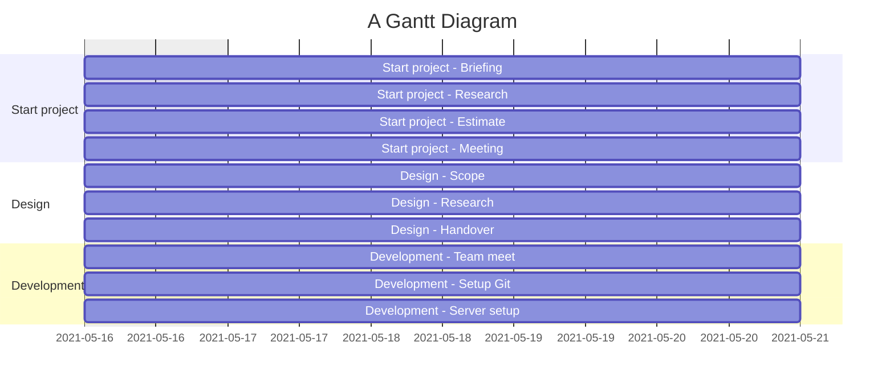

```mermaid
gantt
	title A Gantt Diagram
	dateFormat  YYYY-MM-DD
	excludes    weekends

	%% section Section
	%% A task           :a1, 2014-01-01, 30d
	%% Another task     :after a1  , 20d
	%% section Another
	%% Task in sec      :2014-01-12  , 12d
	%% another task      : 24d


	section Start project
	Start project - Briefing		:2021-05-16, 5d
	Start project - Research		:2021-05-16, 5d
	Start project - Estimate		:2021-05-16, 5d
	Start project - Meeting		:2021-05-16, 5d

	section Design
	Design - Scope		:2021-05-16, 5d
	Design - Research		:2021-05-16, 5d
	Design - Handover		:2021-05-16, 5d

	section Development
	Development - Team meet		:2021-05-16, 5d
	Development - Setup Git		:2021-05-16, 5d
	Development - Server setup		:2021-05-16, 5d

```
