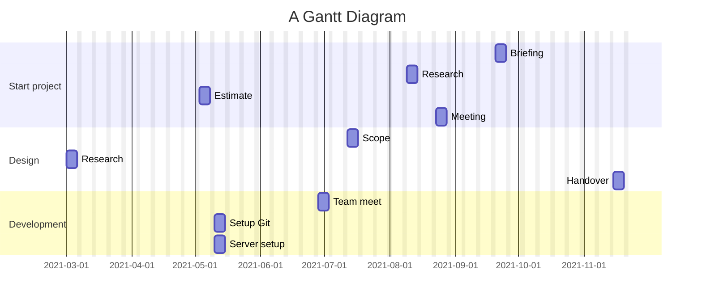

```mermaid
gantt
	title A Gantt Diagram
	dateFormat  YYYY-MM-DD
	excludes    weekends

	%% section Section
	%% A task           :a1, 2014-01-01, 30d
	%% Another task     :after a1  , 20d
	%% section Another
	%% Task in sec      :2014-01-12  , 12d
	%% another task      : 24d


	section Start project
	Briefing		:2021-09-20, 5d
	Research		:2021-08-09, 5d
	Estimate		:2021-05-03, 5d
	Meeting		:2021-08-23, 5d

	section Design
	Scope		:2021-07-12, 5d
	Research		:2021-03-01, 5d
	Handover		:2021-11-15, 5d

	section Development
	Team meet		:2021-06-28, 5d
	Setup Git		:2021-05-10, 5d
	Server setup		:2021-05-10, 5d

```
