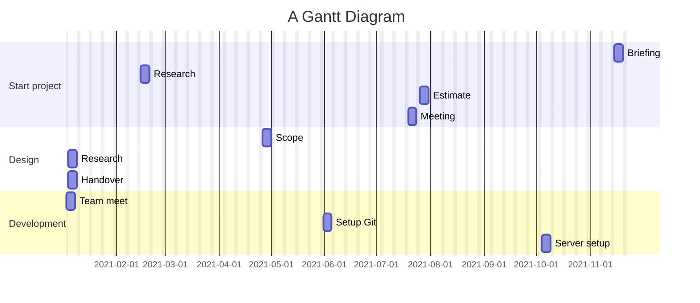

```mermaid
gantt
	title A Gantt Diagram
	dateFormat  YYYY-MM-DD
	excludes    weekends

	%% section Section
	%% A task           :a1, 2014-01-01, 30d
	%% Another task     :after a1  , 20d
	%% section Another
	%% Task in sec      :2014-01-12  , 12d
	%% another task      : 24d


	section Start project
	Briefing		:2021-11-15, 5d
	Research		:2021-02-15, 5d
	Estimate		:2021-07-26, 5d
	Meeting		:2021-07-19, 5d

	section Design
	Scope		:2021-04-26, 5d
	Research		:2021-01-04, 5d
	Handover		:2021-01-04, 5d

	section Development
	Team meet		:2021-01-03, 5d
	Setup Git		:2021-05-31, 5d
	Server setup		:2021-10-04, 5d

```
